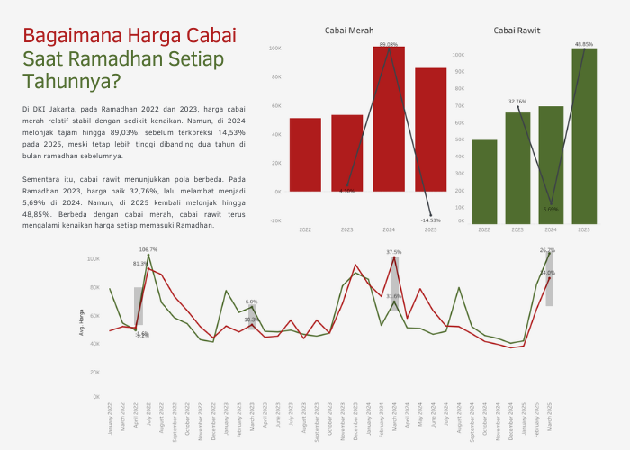
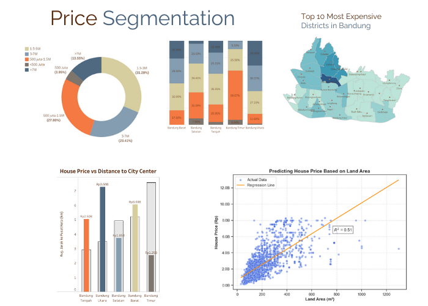

# Portfolio
---
## Visualizing Chili Price Trends
### Eksplorasi Harga Cabai DKI Jakarta (2022-2025)

Dalam project ini, saya menganalisis data harga cabai dari Pusat Informasi Harga Pangan Strategis (PIHPS) untuk memahami tren pergerakannya dalam beberapa tahun terakhir. Saya mengumpulkan, membersihkan, dan memvisualisasikan data untuk menjawab pertanyaan utama: Apakah harga cabai pada periode ramadan 2025 benar-benar lebih mahal dibanding tahun-tahun sebelumnya?

  
Analisis ini mencakup identifikasi pola musiman, perbandingan harga antar tahun, serta penyajian insight berbasis data agar lebih mudah dipahami.
  
- **Skill** : Data Cleansing, Visualization
- **Tools** : Python, Tableau
- **Dataset** : PIHPS (Pusat Informasi Harga Pasar Strategis)

---
### Bandung House Price Analysis
### An Analysis of Bandung's Housing Prices and Market Trends

Dalam project ini, saya melakukan analisis terhadap harga rumah di Bandung menggunakan data hasil web scraping dari platform properti online. Tujuan utama dari proyek ini adalah untuk memahami pola harga rumah, faktor-faktor yang memengaruhi harga rumah, serta distribusi harga di berbagai wilayah di Kota Bandung.

  
- **Skill** : Web Scraping, Data Cleaning, EDA, Visualization, Regression Analysis  
- **Tools** : Python, Tableau  
- **Dataset** : Data hasil *web scraping* 

---

© 2020 Khanh Tran. Powered by Jekyll and the Minimal Theme.

